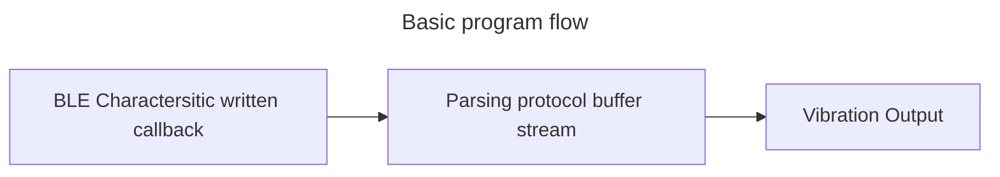
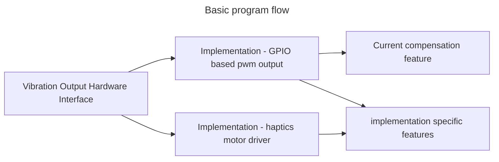

# Simplified structure

- no more unnceccersary interfaces between receiving and outputting
- only one output mode, which is realtime interpretation of the protocol buffers stream

- Vibration Output could be implemented through an interface so that both DRV as well as ULN2803A Output can be used

